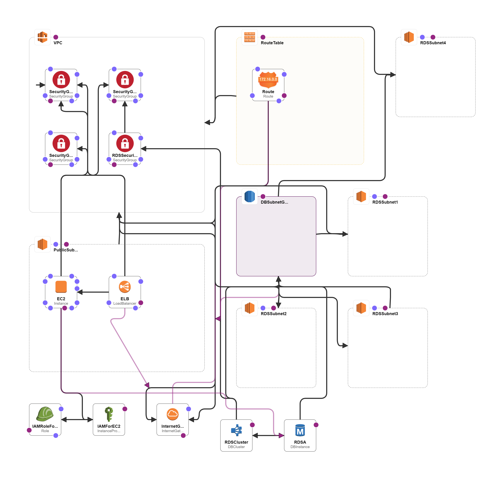

# Architecture

An AWS account is required for this product deployment

Required AWS Services: CLOUDFORMATION, EC2, EBS

These components are deployed: RDS DBCluster, EC2 SecurityGroups, EC2 Subnet, EC2 Route , EC2 RouteTable, EC2 SecurityGroupIngress and EC2 VPC

Below components are deployed as a part of the template:

1. EC2 Windows Server 2016 image&#x20;
2. Aurora RDS cluster service
3. Load balancer

<figure><figcaption></figcaption></figure>

