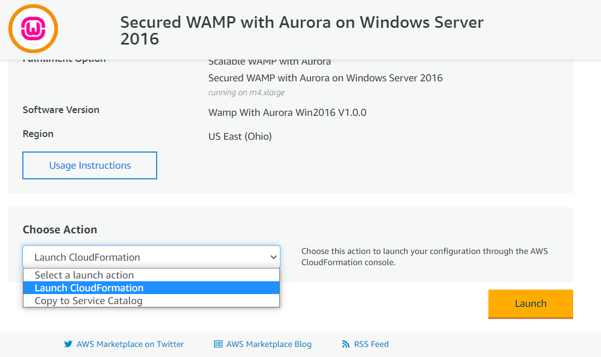

# Getting Started

Visit the Product URL on AWS marketplace: [Secured WAMP with Aurora on Windows Server 2016](https://aws.amazon.com/marketplace/pp/B077D59SPJ?qid=1513568606325\&sr=0-1\&ref\_=srh\_res\_product\_title)

Click on Continue to Subscribe

.png>)

Click on Continue to Configuration

.png>)

In the configuration page click on the Select fulfillment option:

.png>)

Select the fulfilment option as as Cloud formation Template

.png>)

The Ready Template is prefilled

.png>)

