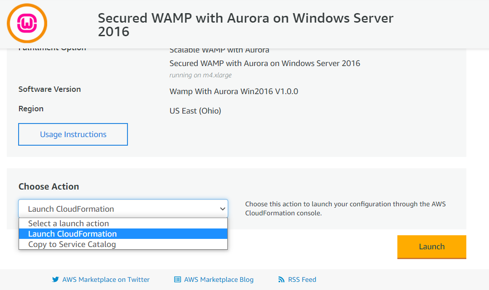
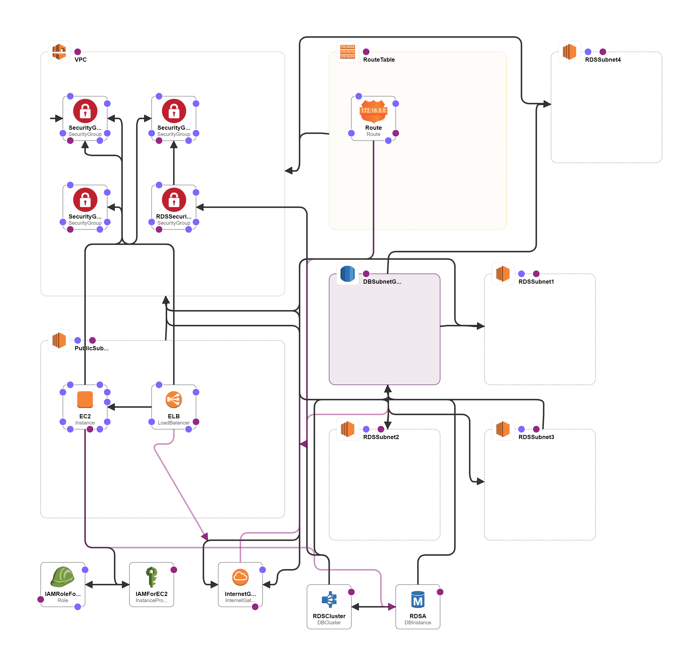

# CFT: Secured WAMP With Aurora - Windows 2016

## Secured WAMP with Aurora on Windows Server 2016

**Introduction**:

**WAMP** is a Web development platform on Windows that allows you to create dynamic Web applications with Apache2, PHP, and MySQL. This Stack Replaces MySQL with highly available MySQL Compliant Cluster -Aurora on secured Windows platform.\
Enterprises are plagued with problem of maintaining a MySQL Cluster including backup, Security and overhead for administration. This product offers Highly scalable, Multiple AZ MySQL Cluster -Aurora. You can replace Aurora Connection String in place of MySQL.

How to launch:

Product URL: [https://aws.amazon.com/marketplace/pp/B077D59SPJ?qid=1513568606325\&sr=0-1\&ref\_=srh\_res\_product\_title](https://aws.amazon.com/marketplace/pp/B077D59SPJ?qid=1513568606325\&sr=0-1\&ref\_=srh\_res\_product\_title)

Click on Continue to Subscribe

.png>)

Click on Continue to Configuration

.png>)

In the configuration page click on the Select fulfillment option:

.png>)

Select the fulfilment option as as Cloud formation Template

.png>)

The Ready Template is prefilled

.png>)

Input a stack name and choose the Availability zones where the Aurora DB is deployed and the instance type depending on the expected load.

.png>)

Input the key name with a existing key which will be used to connect to the instances

.png>)

Setup the Backup Retention for DB snapshots

.png>)

Optional: Add tags or IAM permissions

.png>)

Review all the settings

.png>)

Choose the Rollback options

.png>)

.png>)

.png>)

Information about installed components: Location of Apache Bin : C:\Apache24\bin Location of PHP: C:\PHP Location of htdocs: C:\Apache24\htdocs Location of Aurora Conn Strings: C:\install\Aurora\_credentials.txt

.png>)

.png>)

.png>)

.png>)

<figure><figcaption></figcaption></figure>

**Supported Regions:**

[Aurora MySql Supported Regions](https://docs.aws.amazon.com/AmazonRDS/latest/AuroraUserGuide/Concepts.RegionsAndAvailabilityZones.html#Aurora.Overview.Availability.MySQL) are updated automatically by AWS.

**Security Recommendation:**

Please Do not use root user for any deployment or operations. Here are the instructions for [Using the AWS account root user](https://docs.aws.amazon.com/accounts/latest/reference/root-user.html)

